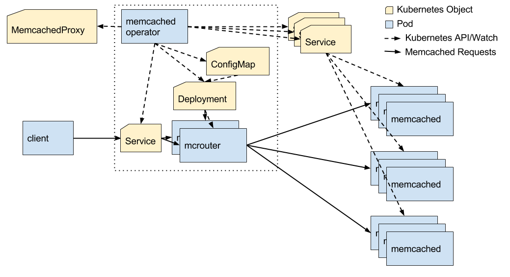

# Memcached Operator Design

This document describes the architecture & design of the memcached operator.

## Overview

Kubernetes provides a built in mechanism for service discovery and rudamentary load balancing using [Services](https://kubernetes.io/docs/concepts/services-networking/service/). Unfortunately this is not ideal for services such as memcached. A typical memcached cluster shardes cache data among servers and uses consistent hashing of the cache key determine the server to connect to. Kubernetes operates on TCP/UDP connections and does not have this level of knowledge of the memcached protocol.

Users can solve this issue with client side load balancing but it requires a method of updating the list when memcached cluster instances are added or deleted. This requires application level support or a sidecar container. Configuration is more complex and backend cache servers may be overloaded with connections.

The memcached operator allows users to access a cluster via a single Kubernetes `Service` endpoint that supports sharding memcached keys using a proxy server.

The memcached operator introduces a `MemcachedProxy` [custom resource definition](https://kubernetes.io/docs/tasks/access-kubernetes-api/extend-api-custom-resource-definitions/) (CRD) which is used to describe a proxy to a set of memcached instances. The memcached operator watches `MemcachedProxy` objects for additions, changes, and deletions. For each `MemcachedProxy` a deployment is created to manage the proxy itself. A configmap and service for the proxy are also created and managed by the memcached operator. Users connect to the proxy via this service endpoint.

If a user scales the memcached cluster by changing the number of pods, the memcached operator will update the memcached proxy configuration and cause it to be reloaded by each proxy instance.

The memcached operator will use [mcrouter](https://github.com/facebook/mcrouter) as the memcached proxy.

## Pools

Each service for a set of memcached clusters maps one-to-one with a [mcrouter pool](https://github.com/facebook/mcrouter/wiki/Pools). The memcached operator supports [sharded](sharded-pools.md) and [replicated](replicated-pools.md) pools, as well as combinations of both, via mcrouter. Sharded clusters shard keys based on a [hash](https://github.com/facebook/mcrouter/wiki/Pools#hash-functions) of the key. Replicated clusters store all keys in on all members of the pool.

## Application architecture

The memcached operator application is written in [Go](http://www.golang.org/) and makes extensive use of the [client-go](https://github.com/kubernetes/client-go) Kubernete client library. The main logic is performed by four Kubernetes controllers (control loops); the [proxy](../pkg/controller/proxy/) controller, the [proxydeployment](../pkg/controller/proxydeployment/), the [proxyservice](../pkg/controller/proxyservice) controller, and the [proxyconfigmap](../pkg/controller/proxyconfigmap/) controller. Each controller's control loop is run in parallel in a goroutine. Controllers are managed using the [controllerutil](https://github.com/ianlewis/controllerutil) library.

## Scaling Memcached Pools

When the pods for the memcached pool are added or deleted, the memcached operator generates a new [mcrouter configuration file](https://github.com/facebook/mcrouter/wiki/Config-Files) and updates a configmap that holds the configuration. When a configmap is updated Kubernetes updates the relavent files mounted in each container. Mcrouter watches changes to the config file and will reload it automatically.
